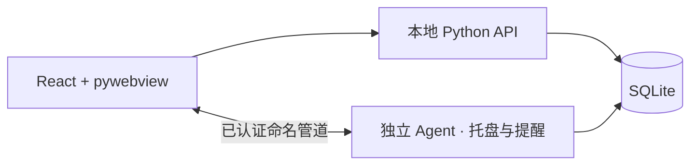

# 架构与数据口径

当前版本使用 React/Vite 页面、Python 本地 HTTP API、SQLite 和 pywebview/WebView2 桌面窗口。`agent.py` 是独立的当前用户会话进程，持有托盘图标并调度 Windows 系统通知；主窗口关闭后仍可运行。两个进程使用 SQLite 短事务和 Windows 命名管道协作。主窗口二次启动会激活已有窗口；托盘“打开主界面”可在窗口进程退出后重新启动它。

`backend/store.py` 管理迁移和任务，`backend/features.py` 管理课表、项目、子任务、专注和提醒记录，`backend/server.py` 提供仅监听 `127.0.0.1` 的随机端口 API。前端与 API 同源，写操作使用会话令牌。数据库版本化升级，目前为 v3。SQLite 使用 WAL、外键和短事务。

课表使用学期第一周星期一计算周数；单双周规则按周次匹配。单次例外保留原课程实例键，取消原课或移动到新日期，避免其余周被改变。课程和项目/任务截止时间由同一持久化数据源进入 Dashboard、DDL 与提醒。

任务与项目截止时间以 UTC 保存，前端按设备当地时间展示。课程规律使用当地日期和时间。专注按后台心跳记录有效片段，暂停和长时间休眠间隔不计入时长；异常重启会将未结束的运行记录恢复为暂停。周统计按片段跨日拆分。项目进度按关联任务的完成状态与子任务完成比例平均计算。

提醒默认在上课前 10 分钟、任务截止前 60 分钟触发，可在设置页修改。Agent 每 15 秒扫描；启动后最多补发 15 分钟内的提醒。唯一投递键防止重复；发送失败会释放记录以便下次重试。Windows 勿扰、系统通知权限及用户注销/关机可能影响实际弹出。当前通知点击跳转到事项详情尚未接入；系统托盘可打开主界面。

当前交付为源码运行版本，尚未制作安装包、登录自启动或云同步。桌面窗口封装依赖本机 WebView2。后续可增加安装/升级体验、备份恢复界面、通知点击跳转和更丰富的统计。
